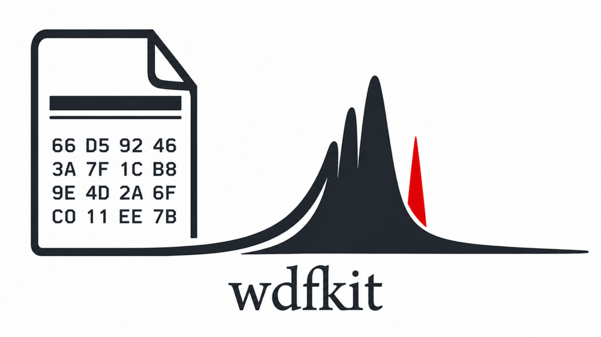

:tocdepth: -1

.. index:: getting-started

.. _getting-started:

================
Getting started
================

``wdfkit`` reads Renishaw WiRE ``.wdf`` spectra into ``xarray.DataArray``
objects and provides preprocessing tools: cosmic-ray removal, Nd:YAG
laser-harmonic notches, normalization, and PCA-based denoising.

:class:`~wdfkit.WDFReader` loads data eagerly by default; pass ``chunks=True``
(or an integer target chunk size in megabytes) for **lazy, Dask-backed**
arrays when working with large maps.

The project is **inspired by** `spectrapy <https://gitlab.in2p3.fr/dejan.skrelic/spectrapy>`__
by **Dejan Skrelic**—an earlier tool that shaped how spectroscopy users treat
this kind of data.

Installation
------------

The quickest way to install is via pip::

    pip install wdfkit

For a conda-based development setup, see the
`README <https://github.com/dshirya/wdfkit#installation>`_.

Reading a ``.wdf`` file
-----------------------

:class:`~wdfkit.WDFReader` loads the file and returns an
``(xr.DataArray, image_or_None)`` pair. It can be unpacked directly:

.. code-block:: python

    from wdfkit import WDFReader

    data, image = WDFReader("measurement.wdf")

    # or keep as an object
    reader = WDFReader("measurement.wdf")
    data = reader.data    # xr.DataArray
    image = reader.image  # white-light image, or None

Optional keyword arguments include ``spectral_dim`` (override the automatic
spectral-axis name), ``chunks`` (lazy/Dask chunking), ``verbose``, and
``time_coord`` — see the class docstring for details.

The ``DataArray`` rank and dimension names depend on how WiRE acquired the
data:

- **Single spectrum** → **1D** ``(spectral_dim,)`` (only the spectral axis).
- **Series** (e.g. depth or stage stacks) → **2D** ``(series_axis, spectral_dim)``.
  The first dimension is named from ORGN metadata when possible (for example
  ``"SpatialZ"``).
- **Line scans, XY lines, random-point maps** → **2D** ``("point",
  spectral_dim)`` with spatial coordinates on ``point`` when present.
- **Raster maps** → **3D** ``("y", "x", spectral_dim)``.

The spectral coordinate name is inferred automatically from the file's
``XlistDataUnits`` (e.g. wavelength-related units → ``"nm"``, Raman shift →
``"raman_shift"``). Override with ``spectral_dim``, including legacy notebooks
that expect ``"shifts"``::

    data, _ = WDFReader("measurement.wdf", spectral_dim="shifts")

:func:`~wdfkit.read` loads the same cube or spectrum but returns **only** the
``DataArray`` (no white-light image). :func:`~wdfkit.classify` returns a small
summary dict (scan ``kind``, counts, flags) **without** reading the spectral
payload — useful for scripting over folders of ``.wdf`` files.

Cosmic-ray removal
------------------

Use :class:`~wdfkit.CosmicRayRemover` for maps, line scans (2D stacks along
``point`` or similar), and single spectra expressed as **2D**
``(n_row, spectral_dim)`` with ``n_row == 1``. The default pipeline runs
**laser-harmonic notch first**, then **spike removal**:

.. code-block:: python

    from wdfkit import WDFReader, CosmicRayRemover

    data, _ = WDFReader("map.wdf")

    remover = CosmicRayRemover()       # all defaults
    data_clean = remover.remove(data)  # harmonics + cosmic rays

If :class:`~wdfkit.WDFReader` returned a **1D** single spectrum, add a
singleton axis so the spectral dimension stays **last** (shape
``(1, n_spectral)``) before calling the remover::

    data, _ = WDFReader("single.wdf")
    if data.ndim == 1:
        data = data.expand_dims("spectrum")
    data_clean = CosmicRayRemover().remove(data)

For fine-grained control, call the steps separately:

.. code-block:: python

    remover = CosmicRayRemover(
        spike_threshold=4.0,     # lower threshold → more aggressive
        map_sensitivity=0.02,    # more aggressive map detection
    )

    data_no_harmonics = remover.harmonic_check(data)
    data_clean = remover.remove_cosmic_rays(data_no_harmonics)

To inspect detections and masks, use the diagnostics method (keys depend on
dimensionality — **3D maps** expose ``core_mask`` / ``repair_mask``; **2D**
collections expose ``core_mask`` and ``reference``; **1D** exposes
``cosmic_mask``):

.. code-block:: python

    data_clean, diagnostics = remover.remove_with_diagnostics(data)
    # e.g. diagnostics["core_mask"] — boolean array of detected spikes
    # diagnostics["repair_mask"] — dilated mask that was interpolated

Key parameters for **1D / per-spectrum** removal:

.. list-table::
   :header-rows: 1
   :widths: 30 70

   * - Parameter
     - Description
   * - ``spike_width``
     - Odd integer ≥ 3; median filter window (default ``5``)
   * - ``spike_threshold``
     - Multiplier on robust MAD noise (lower → more aggressive, default ``3.5``)
   * - ``spike_passes``
     - Number of detect–repair iterations (default ``3``)

Key parameters for **map** removal:

.. list-table::
   :header-rows: 1
   :widths: 30 70

   * - Parameter
     - Description
   * - ``map_method``
     - ``"median"`` (default) or ``"pca"`` reference for 2D/3D collections
   * - ``map_sensitivity``
     - Scales detection aggressiveness for 3D disk-median engine (default ``0.01``)
   * - ``map_disk_radius``
     - Spatial disk radius for the 3D median reference filter (default ``3``)
   * - ``map_spike_width``
     - Spectral dilation window as a fraction of spectrum length (default ``0.02``)
   * - ``map_n_components``
     - Number of PCA components when ``map_method="pca"`` (default ``3``)

See :class:`~wdfkit.CosmicRayRemover` for the full parameter list.

Normalization
-------------

:func:`~wdfkit.normalize` scales spectra along the spectral axis:

.. code-block:: python

    from wdfkit import normalize

    data_norm = normalize(data, method="area")

Available methods: ``"l1"``, ``"l2"``, ``"max"``, ``"min_max"``,
``"robust_scale"`` (default), ``"area"``, ``"wave_number"``. Pass
``spectral_dim`` if the spectral axis is not the **last** dimension. Per-
spectrum methods can run **chunk-wise** on Dask-backed arrays; ``"robust_scale"``
and ``"wave_number"`` need the full dataset in memory first (see the function
docstring).

PCA denoising
-------------

:class:`~wdfkit.SpectraCleaner` removes noise from a **population** of spectra
using PCA reconstruction. Typical inputs are **3D** map cubes
``(y, x, spectral_dim)`` or **2D** stacks ``(n_spectra, spectral_dim)``. It
requires **more than one spectrum** — for a single spectrum use a 1D smoother
instead.

.. code-block:: python

    from wdfkit import WDFReader, SpectraCleaner

    data, _ = WDFReader("map.wdf")

    cleaner = SpectraCleaner(n_components="mle")  # Minka's MLE picks component count
    data_clean = cleaner.clean(data)

To also retrieve the PCA decomposition (components, per-spectrum scores,
explained variance arrays):

.. code-block:: python

    cleaner = SpectraCleaner(n_components=0.95)   # keep 95 % of variance
    data_clean, decomp = cleaner.clean_with_decomposition(data)

    components = decomp["components"]              # shape (n_components, n_spectral)
    coeffs = decomp["coeffs"]                      # same spatial layout as input + components axis
    ratio = decomp["explained_variance_ratio"]     # length n_components

Overall variance explained by the retained components is summarized on the
cleaned array under ``attrs["treatments"]["spectra_cleaning"]``
(``explained_variance_ratio_total``, ``n_components_used``, and related
fields). Large arrays live only in ``decomp`` (``components``, ``coeffs``, …).

Typical workflow
----------------

A common end-to-end pipeline for a Raman/PL map:

.. code-block:: python

    from wdfkit import WDFReader, CosmicRayRemover, normalize, SpectraCleaner

    # 1. Load
    data, image = WDFReader("map.wdf")

    # 2. Remove cosmic rays (harmonics + spikes).
    #    Oversaturated spectra are detected and removed automatically.
    data = CosmicRayRemover().remove(data)

    # 3. Normalize
    data = normalize(data, method="area")

    # 4. PCA denoise.
    #    Oversaturated spectra are also checked automatically here.
    data = SpectraCleaner(n_components="mle").clean(data)
